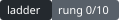

# ca-ladder

A daily ladder-bet manager. Pulls moneylines from **ESPN's public JSON — no API
key, no signup, no quota**, filters to a **-200 to -150** window, ranks by
de-vigged win probability, and tracks a compounding ladder that rolls the full
return forward and resets on a loss. Finished games are graded automatically
from ESPN's final scores.

Ships an HTML dashboard (auto-published to GitHub Pages) and coloured terminal
output. Python standard library only — 82 tests, no dependencies.



---

## The correction that changes your numbers

Your first message said "**-150** odds, bet $5 at **1.50**". Those are two
different prices:

| American | Decimal | Break-even win rate |
|---------:|--------:|--------------------:|
| **-150** | 1.667 | 60.0% |
| **-175** | 1.571 | 63.6% |
| **-200** | 1.500 | 66.7% |

You confirmed you want the band between them, so `config.json` ships with
`min_decimal 1.50` / `max_decimal 1.667`. Note what the table shows: inside this
band, a shorter price *is* a higher win chance. Ranking by "best chance of
winning" pulls you toward -200 most days, and -200 needs you right two times in
three just to break even.

## Where the odds come from

```
https://site.api.espn.com/apis/site/v2/sports/{sport}/{league}/scoreboard
```

Undocumented, unsupported, and free. Moneylines sit at
`events[].competitions[].odds[].moneyline.home.close.odds`. Run
`python -m ladder leagues` for the twelve leagues wired up.

**One honest limitation.** ESPN returns a *single* provider per game
(DraftKings in every payload I checked), so there is no cross-book consensus to
compare against. De-vigging one book gives you that book's fair probability —
a good estimate, since the market is hard to beat — but "edge" measured against
the same book is circular: it always equals `-hold/(1+hold)` for both sides.
The code does not pretend otherwise. It reports `vig_cost`, labelled as the
hold, and only fills in `cross_book_edge` when two or more providers actually
appear.

Two more things worth knowing:

- ESPN shows the **US** DraftKings line. The disclaimer in its own payload
  reads "Void in ONT." Your Ontario or provincial book will price slightly
  differently, so treat the pick as *which side*, and take the price you
  actually get.
- Moneylines come back as `"OFF"` when a book pulls the market. Handled.

## What the selector does

1. Skip anything not in a `pre` state, or starting beyond `horizon_hours`.
2. De-vig the complete market proportionally (three-way for soccer).
3. Reject holds above `max_hold`, and **reject negative holds** — a single book
   never offers arbitrage, so that means bad or partial data.
4. Keep the side only if its decimal price lands in 1.40–1.667 (-250 to -150).
5. Rank by de-vigged win probability; tiebreak on cheaper hold.

Soccer is included but is a worse fit: the draw makes it a three-way market,
which in testing carried roughly 6.8% hold versus 4.1% on a two-way baseball
line. Tennis odds on ESPN are sparse and golf is outrights only, so neither
reliably produces a price in your band.

## Projections use the price you are actually getting

The dashboard originally drew every rung at 1.667 (-150), the best-case end of
the window, no matter what price you were really taking. So it promised
`$5.00 -> $8.34` while a -191 favourite pays $7.62 and a -167 pays $7.99. The
staircase now prices off the bet in play — your pending bet first, else today's
top candidate, else the midpoint of the window — and says which it used.

| Price | Decimal | $5 returns | Profit |
|---:|---:|---:|---:|
| -150 | 1.667 | $8.33 | $3.33 |
| -167 | 1.599 | $7.99 | $2.99 |
| -191 | 1.524 | $7.62 | $2.62 |
| -200 | 1.500 | $7.50 | $2.50 |

Every candidate now also shows `stake -> return (profit)` at your current rung,
so the number on screen is the number the book will pay.

## The dashboard is interactive

The page is static — GitHub Pages cannot write back to the repo — but its local
browser ledger is fully interactive. `state/ladder.json` remains the committed
record, while the browser tracks the bets you actually select on that device.

What you can do on the page:

- **Edit the odds.** Each candidate has American and decimal boxes that stay in
  sync. Type the price your book is actually showing and the stake, return,
  profit, break-even, edge and the entire ladder staircase recalculate live.
  `reset` puts the screened price back.
- **Select one bet.** Tap **Select bet** on any card. Only one bet can be pending;
  the other choices lock until you mark it Win, Loss or Push (or remove it).
- **Keep climbing the same day.** A win immediately advances the rung, updates
  the next stake, and unlocks all later options. There is no one-bet-per-day lock.
- **Settle automatically.** While the page is open it checks the published
  result feed and the selected event's ESPN scoreboard every minute. **Check
  now** forces an immediate refresh. A final win advances; a final loss resets
  the ladder to rung 0 and $5.
- **Enter a custom bet.** If your sportsbook has a choice missing from the feed,
  enter its selection, American odds and stake directly under My ladder.
- **Copy the command.** The box shows the exact `ladder place N --price X` line
  for whatever you selected and edited. Run it to make it real.

Editing a candidate only previews the price. **Select bet** records it in the
browser ledger; the command box is still available when you want to commit the
same selection into the repo state.

## The repo ships mid-ladder

`state/ladder.json` contains the -167 Yankees winner from 2 September, the -171
Pirates winner from 3 September, and the -195 Liverpool winner from 4 September.
Liverpool staked $12.66 and returned $19.15, so the live ladder is now **rung 3
with $19.15 next** (3–0, +$14.15 bet profit/loss).

Committed history now merges into the browser automatically without duplicating
the same real bet. If the matching browser entry is still pending, the committed
result updates it in place so it cannot hold the ladder back. **Load repo
history** remains as a manual refresh control.

### Staircase now uses real stakes

It was rebuilding every rung from `base_stake` at one assumed price, so rung 1
read $7.92 — base compounded at the window midpoint — when the actual stake on
the table was $7.99. Climbed rungs now show the stakes you really bet, and a
climbed rung's return is the next rung's stake, because that is what you
actually collected.

## My ladder — the browser ledger

Modelled on `mlb-edge-lab`'s My Ledger, adapted to a ladder.

Tap **Select bet** on any candidate and it lands at that price — including any
price you typed into the odds box — with the rung's stake prefilled. Tap the
stake to change it if you bet a different number. Leave the page open and it
checks the selected game's official ESPN result every minute, or press **Check
now**. Manual Win, Loss and Push remain as fallbacks. Every build also publishes
`docs/data/results.json` with finished games for automatic settlement.

The one real difference from a flat bet ledger: **a ladder is sequential.**
Rung N's stake is rung N-1's return, so the whole chain is recomputed on every
change. Edit one stake and everything after it reflows — in testing, changing a
rung-1 stake from $8.00 to $6.00 pulled rung 2 from $12.40 down to $9.30.

Storage is your browser's, per device, and nothing leaves the page. **Export
JSON** or **Export CSV** writes the whole ledger out so it survives a cleared
browser or moves to another device, where **Import** merges it back without
duplicating anything already there. Downloads are blocked in some embedded
viewers, so the export panel always shows the text to copy as well.

### Two engines, pinned together

There are now two implementations of the ladder — Python in `state.py`,
JavaScript in `webledger.py` — which is exactly the arrangement that goes
quietly wrong. `test_browser_and_python_ladders_agree` replays the same sequence
through both and fails on any drift.

It has already caught one: the JS was compounding full float precision while
Python rounded the payout to cents first. By rung 3 that was a one-cent gap
($20.08 vs $20.09) and it would have widened. Python was right — a book pays
whole cents — so the JS now rounds before compounding.

### Repo state vs your ledger

Kept apart on purpose, same reasoning as `mlb-edge-lab`. `state/ladder.json` is
what the automation did with the screened price. The browser ledger is what
**you** actually bet, at your price, with your stake. Answering both with one
number hides which is which the first time a month goes badly.

## Bet history

Every settled bet is stored in `state/ladder.json` and committed to the repo by
the workflow, so the record survives across machines. The dashboard shows all of
them — date, pick, matchup, rung, price, stake, return, result, per-bet P/L and
running P/L — and `ladder ledger --csv out.csv` exports the lot.

## Choosing which bet to place

The list is numbered; place any of them:

```bash
python -m ladder pick                      # numbered candidates
python -m ladder place 2                   # take the second one
python -m ladder place 2 --price 1.52      # at the price you actually got
python -m ladder place 2 --stake 4.75      # and the stake the book took
```

Rank 1 is the highest de-vigged win probability, but it is not an instruction —
if you know something about a game, take a different number.

## Cash-out rung: you have this set to 10

`max_rung` is 10, as you asked. Worth knowing what that costs, at a 62% win
rate on 1.60 odds:

| Cash out at | Chance of getting there | Pays | EV of the $5 run |
|---:|---:|---:|---:|
| 3 | 24.2% | $20.48 | $4.95 |
| **5** | **9.4%** | **$52.43** | **$4.92** |
| 8 | 2.3% | $214.75 | $4.87 |
| 10 | 0.9% | $549.76 | $4.84 |

Shorter ladders are better on *both* counts: EV is higher and cash-outs are far
more frequent. Rung 10 pays $549 but arrives less than once per hundred runs,
so most months end with nothing banked. Rung 10 also means a final stake near
$400 at real prices, which is why `max_stake` is set to 400 as a backstop — the
ladder will refuse a rung above it and tell you to cash out.

If a run ever gets deep, `ladder cashout` banks the stack at any rung. Nothing
forces you to ride to 10.

## Line movement

ESPN returns both the opening and closing price, so the selector reports drift:
if a favourite went -150 → -185, money came in on that side and the market
moved toward it. Shown as `shortened` / `drifted` / `line barely moved`. It is
context, not a green light — you are getting the worse number by then.

## The price you get is not the price you saw

Between screening a bet and placing it, the line moves. The ladder compounds the
**real** return, so record the real fill:

```bash
python -m ladder pick --place --price 1.54      # you took 1.54, not the 1.60 shown
python -m ladder pick --place --pick 2          # place the 2nd-ranked bet instead
python -m ladder pick --place --stake 11.50     # book would not take the exact amount
python -m ladder amend --price 1.52 --stake 4.75   # fix it after the fact
```

Every bet stores `screened_decimal`, the actual `decimal`, and the gap between
them as `slippage`. Over time the ledger averages it, which tells you what the
delay between seeing and betting is costing you.

Two related settings in `config.json`:

- `stake_increment` (default 0.01) rounds stakes **down**, never up. Keep it at
  0.01: rounding to quarters looks tidier but leaks value at every rung, and by
  rung 10 costs about $21 of a $549 stack.
- `max_stake` (default 0 = off). Set it to, say, 100 and the ladder refuses to
  place a rung above it and tells you to cash out instead. A hard rail against
  a $5 hobby quietly turning into a $300 bet.

## Backtest before you fund it

Every win-rate number elsewhere in this README is an **assumption**. This
replaces it with your leagues, your window, real prices, real results.

```bash
python -m ladder backtest --days 90 --leagues mlb,nhl
python -m ladder backtest --days 90 --use-open      # pessimistic bound
python -m ladder backtest --days 90 --csv bt.csv
```

ESPN's `?dates=YYYYMMDD` returns closing odds *and* final scores, so the
backtester runs the exact same selector over past days and grades what
happened. Responses cache to `.cache/`, so the first run is slow (about half a
second per league-day, deliberately) and every re-run is instant.

What it reports:

- **actual hit rate** vs **model predicted** — the calibration gap. If the
  de-vigged prices say 62% and reality says 62%, the market is calibrated and
  there is no edge to find in this window. A persistent positive gap over a few
  hundred bets is the only thing that would justify running this seriously.
- **edge vs break-even** — the number that decides whether to do this at all.
- **net by cash-out rung** for 3/4/5/6/8/10, so you can see which ladder length
  actually paid on real data rather than on my assumed 62%.

### Reading it without fooling yourself

The backtest now reports a **95% Wilson confidence interval** on the hit rate,
and states a verdict rather than leaving you to eyeball the gap. This matters
more than the gap itself. On ~80 bets the interval is roughly **21 points
wide** — 62.5% comes with a range of [51.5%, 72.3%]. Almost any calibration gap
you see at that sample size is noise.

The sample sizes required are sobering, and the tool prints them:

| To detect a true edge of | Bets needed | At one bet a day |
|---:|---:|---:|
| 5 points | ~715 | ~2 years |
| 2 points | ~4,465 | ~12 years |

So a 90-day backtest cannot establish an edge. It **can** rule one out — if the
interval sits entirely below break-even, that is a real answer, and a useful
one.

It also breaks results down **by price band** (1.50-1.55 / 1.55-1.60 /
1.60-1.667) and **by league**, each with its own interval, so a headline number
cannot hide a band that is quietly terrible.

### Why the bootstrap column exists

A ladder's net depends heavily on the **order** results arrive in — the same
bets rearranged can cash out twice or never. The historical ordering is one
draw from that distribution, so reporting only its net badly overstates what
you know. The backtest resamples the same bets 4,000 times.

In testing against a synthetic market built to have **exactly zero edge**, one
cash-out rung showed an "actual" net of **+$22** while the bootstrap median for
the same bets was **-$55**, with only 30% of orderings profitable. A profitable
backtest on a provably unprofitable market. Read the median and the spread, not
the actual column.

Two more caveats it prints for itself, and you should believe both:

1. **Look-ahead bias.** Selection uses the closing price, which you cannot know
   when betting. Real results land somewhat worse. `--use-open` prices off the
   opening line, which is pessimistic in the other direction — the truth is
   between the two, so run both.
2. **Survivorship.** Postponed and voided games vanish from the feed. Days with
   no data are skipped, not counted as losses.

## Guards

- `one_bet_per_day` (off) — a settled winner can be rolled into another eligible
  game the same day. The one-pending-bet rule still prevents overlapping rungs.
- `stop_loss_busts` (8) / `stop_loss_days` (30) — after that many busted runs
  in the window the ladder halts and refuses to place. `ladder resume` restarts
  it, which is the point: restarting should be a decision, not a default.
- `max_stake` (0 = off) — refuses any rung above the ceiling and tells you to
  cash out.

## Ledger

```bash
python -m ladder ledger              # table + summary
python -m ladder ledger --csv out.csv
```

Every bet with rung, real price, stake, return, per-bet P/L, running P/L and the
ladder's banked net. The summary carries the two numbers worth watching:

**Slippage** — screened price minus what you took. Pure friction; you want it
near zero.

**CLV** (closing line value) — your price minus the closing price, filled in
automatically at settle time from ESPN's closing number. This is the honest
scoreboard. Outcome luck washes out over a few hundred bets; CLV does not. If
you are consistently beating the close you are picking well even during a losing
stretch, and if you are consistently behind it no win streak makes the system
sound. Override with `--closing 1.52`, or skip with `--no-clv`.

## Ladder rules

- Rung 0 stakes `base_stake` ($5) of new money.
- A win rolls the **entire return** forward as the next stake.
- A loss resets to rung 0. **New money at risk per run is capped at $5.**
- A push holds your position.
- Hitting `max_rung` (default 8) cashes out and starts fresh.
- **A day with no qualifying bet is a valid day.** The ladder holds; it does not
  reset. Forcing a bet to keep a streak alive is how these end.

Projection at 1.667 from $5:

```
rung 0   $5.00 -> $8.34        rung 4   $38.61 -> $64.36
rung 1   $8.34 -> $13.89       rung 5   $64.36 -> $107.30
rung 2  $13.89 -> $23.16       rung 6  $107.30 -> $178.86
rung 3  $23.16 -> $38.61       rung 7  $178.86 -> $298.16
```

## Usage

```bash
git clone <your-repo> && cd ca-ladder

python -m ladder leagues                 # what's available
python -m ladder pick --top 10           # today's candidates
python -m ladder pick --top 1 --place    # commit the rung
python -m ladder status                  # rung, stake, projection
python -m ladder settle auto             # grade from ESPN's final score
python -m ladder settle win              # or override manually
python -m ladder cashout                 # bank early, reset
python -m ladder sim --decimal 1.55      # monte carlo
python -m ladder render                  # build docs/index.html + badge.svg
python -m ladder ledger                  # bet history, slippage, CLV, net
python -m ladder amend --price 1.52      # correct a pending bet
python -m ladder backtest --days 90      # replay real history
python -m ladder resume                  # clear a stop-loss halt

python -m ladder pick --leagues nhl,nba --date 20260315
python -m ladder dump --leagues mlb --out tests/fixtures/live.json
```

`dump` saves a raw payload so you can develop and test offline against real
data, which is also how the bundled fixture was built.

## Dashboard

`python -m ladder render` writes a self-contained `docs/index.html` — no CDN, no
JS, no build step. It shows the rung staircase as SVG (won rungs solid, the live
rung glowing, rungs ahead dimmed and scaled by stake), metric cards, today's
candidates with win-probability bars, a net-over-time sparkline, and the full
history. It also emits `docs/badge.svg` for the README.

The terminal output is coloured too, with the same staircase in block
characters. Respects `NO_COLOR` and degrades to plain text when piped.

## The ladder only moves if a bet is recorded

The state machine advances on `place` then `settle`. If nothing is placed,
nothing settles, and the rung never changes no matter how many picks get
printed. The workflow now refreshes the selectable option board in one ordered run:

1. **settle** any committed pending bet if its game is final
2. **publish** up to 10 ranked choices without silently selecting one
3. **render** and deploy the dashboard

Order matters — settlement has to come first so a completed winner can expose
the next rung at its new stake. If a step legitimately cannot act (game not
final or stop-loss tripped), it exits clean instead of failing the run.

### Recording a bet you placed yourself

The automation cannot see your betting account. When you bet at the book
yourself, or when a game has already finished, tell the ladder:

```bash
python -m ladder record "New York Yankees" --american -167 --result win
python -m ladder record "Blue Jays" --price 1.54 --league mlb   # leave it pending
```

A win rolls the full return into the next rung. A loss resets to rung 0 and
books -$5 against your net. Both show up in `ladder ledger`.

### Why settlement was failing

`grade_bet` looked for the game in ESPN's *current* scoreboard window, which
rolls forward — a game that finished last night has often already dropped out
of it. It now looks the game up by **its own start date**, then sweeps a couple
of days either side before giving up.

The browser had a second failure: it fetched `results.json` only once at page
load, and when committed history matched a local pending bet it skipped the row
instead of applying the result. It now polls every minute, checks that exact
event directly, and reconciles a committed win/loss into the matching local row.

## Automation

`.github/workflows/daily-pick.yml` refreshes at 14:00, 18:00 and 22:00 UTC,
auto-settles any committed pending bet, publishes the latest choices, rebuilds
the dashboard and deploys it to GitHub Pages. A push also triggers a refresh.
No secrets are required. Enable Pages under **Settings → Pages → Source: GitHub
Actions**.

## What the simulator says

`python -m ladder sim --decimal 1.55`, assuming a 62.3% true win rate against a
64.5% break-even (a ~2.2% book edge, which is generous):

```
per_bet_ev              -0.034
mean_net                -173.44
median_net              -200.26
pct_profitable          0.2507
mean_busts_per_year     137.5
mean_cashouts_per_year  3.18

 3 straight: 24.204%   pays $18.62     EV $4.51
 5 straight:  9.400%   pays $44.73     EV $4.20
 8 straight:  2.275%   pays $166.58    EV $3.79
10 straight:  0.884%   pays $400.21    EV $3.54
15 straight:  0.083%   pays $3,580.51  EV $2.97
```

Read the EV column. Each $5 ladder is worth `5 × (p × d)^n`. Since `p × d < 1`
once the hold is priced in, **every additional rung lowers the expected value of
the run.** Compounding changes the shape of the outcome, not its sign — it
converts many small losses into one rare large win worth less than the losses.
About one simulated year in four finishes ahead.

The genuinely good property of your design is the $5 cap on new money per run.
That is real, and it is why this is a survivable hobby rather than a martingale.
It is not an edge.

## Layout

```
ladder/espn.py       keyless scoreboard client, moneyline parsing, grading
ladder/selector.py   de-vig, screen to the odds window, rank
ladder/state.py      ladder state machine, JSON persistence
ladder/oddsmath.py   conversions, hold, EV, survival
ladder/sim.py        monte carlo
ladder/backtest.py   replay past days, calibration, net by cash-out rung
ladder/stats.py      Wilson intervals, sample-size math, bootstrap
ladder/ledger.py     bet history, slippage, CLV, running net, CSV
ladder/render.py     HTML dashboard, SVG staircase, README badge
ladder/tui.py        coloured terminal output
ladder/cli.py        commands
```

## Putting this on GitHub

```bash
cd ca-ladder
git init -b main
git add .
git commit -m "ladder: initial commit"
```

Then make an empty repo at <https://github.com/new> — **no** README, .gitignore
or licence, or the first push will conflict. Copy the URL it gives you and:

```bash
git remote add origin https://github.com/YOUR-USERNAME/ca-ladder.git
git push -u origin main
```

If it asks for a password, GitHub wants a token, not your account password:
**Settings → Developer settings → Personal access tokens → Fine-grained → Generate**,
give it Contents read/write on this repo, and paste the token as the password.

Then, in the new repo:

1. **Settings → Pages → Source: GitHub Actions** — turns on the dashboard.
2. **Settings → Actions → General → Workflow permissions → Read and write** —
   lets the bot commit state and open issues.
3. **Actions → Ladder → Run workflow** to try it once by hand.

Day to day: the workflow refreshes choices and settles committed bets, but it
does not choose for you. After placing a real bet, record the actual price:

```bash
git pull
python -m ladder pick --place --price 1.54
git commit -am "placed" && git push
```

`state/ladder.json` is the single source of truth and lives in the repo, so
always `git pull` before running commands locally.

## Notes

19+ (18+ in AB, MB, QC). This is a bookkeeping and odds-screening tool, not
advice, and nothing here predicts outcomes. If chasing a streak starts to feel
compulsory, ConnexOntario is 1-866-531-2600 and the Canada Safer Gambling line
is 1-833-353-3234.
